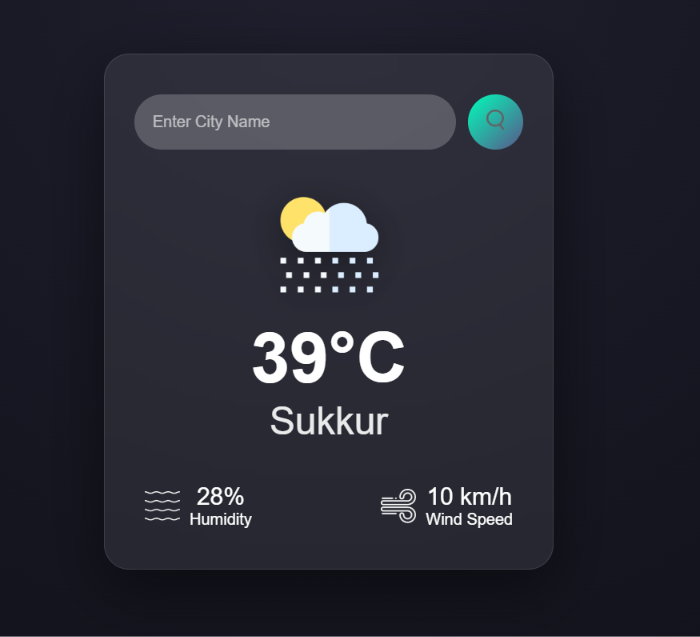

# 🌤️ Weather App

A clean, real-time weather app built with pure **HTML**, **CSS**, and **JavaScript**, powered by the OpenWeatherMap API. Search any city and instantly get live temperature, humidity, and wind speed with matching weather icons.

---

## 🖼️ Preview



---

## ✨ Features

* 🔍 Search weather by city name
* 🌡️ Live temperature in Celsius
* 💧 Humidity percentage
* 🌬️ Wind speed in km/h
* 🌤️ Dynamic weather icons (Clear, Clouds, Rain, Drizzle, Mist)
* ⚠️ Error handling for invalid city names
* 🎨 Glassmorphism card with radial dark background

---

## 📁 Project Structure

```txt
WeatherApp/
├── index.html
├── style.css
├── script.js
├── .env.example
├── .gitignore
├── preview.png
└── images/
    ├── search.png
    ├── clear.png
    ├── clouds.png
    ├── rain.png
    ├── drizzle.png
    ├── mist.png
    ├── humidity.png
    └── wind.png
```

---

## 🚀 Getting Started

### 1. Get a free API key

* Go to [openweathermap.org](https://openweathermap.org/)
* Sign up for a free account
* Navigate to **API Keys** and copy your key

### 2. Create a `.env` file

Create a file named `.env` in the project root:

```env
API_KEY=your_actual_api_key_here
```

### 3. Add your API key in `script.js`

```js
const apiKey = "YOUR_API_KEY";
```

> Replace `"YOUR_API_KEY"` with your own API key locally.

### 4. Clone & open

```bash
git clone https://github.com/your-username/weather-app.git
cd weather-app
open index.html
```

---

## 🌐 API Used

This app uses the free **OpenWeatherMap Current Weather API**:

```txt
https://api.openweathermap.org/data/2.5/weather?q={city}&units=metric&appid={apiKey}
```

**Free tier includes:**

* 60 calls/minute
* Current weather data
* No credit card required

---

## 🛠️ Customization

### Switch to Fahrenheit

In `script.js`, change `units=metric` to `units=imperial`:

```js
const apiUrl = "https://api.openweathermap.org/data/2.5/weather?&units=imperial&q=";
```

And update the `°C` label in your HTML to `°F`.

### Add more weather conditions

In `script.js`, extend the icon mapping:

```js
} else if (data.weather[0].main == "Snow") {
  weatherIcon.src = "images/snow.png";
} else if (data.weather[0].main == "Thunderstorm") {
  weatherIcon.src = "images/thunderstorm.png";
}
```

### Search on Enter key

```js
searchBox.addEventListener("keypress", (e) => {
  if (e.key === "Enter") checkWeather(searchBox.value);
});
```

---

## 🎬 Animations & Styling

| Feature       | Detail                                           |
| ------------- | ------------------------------------------------ |
| Background    | Radial gradient — dark center to deep navy       |
| Card          | Glassmorphism with `backdrop-filter: blur(20px)` |
| Search button | Gradient teal hover with scale effect            |
| Weather icon  | Drop shadow for floating effect                  |
| Error message | Shown/hidden via `display` toggle                |

---

## 🔒 API Key Safety

* ✅ Keep your real API key private
* ✅ Use a placeholder like `"YOUR_API_KEY"` before pushing to GitHub
* ✅ Add `.env` to `.gitignore`
* ❌ Never commit your actual API key to a public repository

Example `.gitignore`:

```gitignore
.env
```

Example `.env.example`:

```env
API_KEY=your_api_key_here
```

---

## 🙋‍♀️ Author

**Kaneeza Batool**
CS Undergraduate · Sukkur, Pakistan
Built with 🌤️ using HTML, CSS, JS & OpenWeatherMap API
